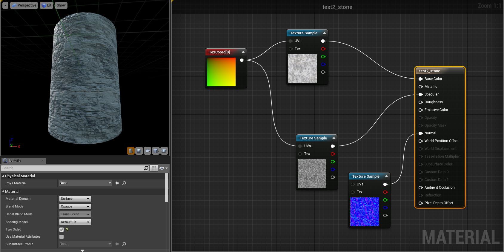

# Introduction to Programming 2016 - Assignment 2  
**PABLO LARENAS**  
**Designer**  
*January 2017*

#THE PROJECT

The game concept is play with a character chosen by the temple’s spirits to protect the ancient ruins and its relics from a coming menace. In the game the player control that character from a First Person perspective.
In this prototype, the player can play a demo version in which he can explore an introductory temple level, experimenting the key mechanics, to test and, therefore, validate several design aspects of it, such as puzzles, obstacles, UI and art (lights, atmosphere and aesthetics).
In this version of the game (Demo) we currently have water, fire and air. With each element, the player can either absorb or cast the element from a mystical glove gun, activating or deactivating several triggerable objects to solve the puzzles. 

#ACTIVITIES AS LEAD/TECHNICAL ARTIST

My role consisted in managing both aesthetical and design criteria for the game, being responsible of the look and feel of it, and constantly working next to Matthew and Robert in the blueprint specifications, application and edition among the project. 
One of the features of this prototype is its level of exceution, coherence and playability considerations. As Lead artist, my role consisted in manage a correct art implementation according with our scope, brief, game definitions, user considerations, deadline and resources and mostly important, its applicability in the engine and blueprint-base workflow. 

In the first part I actively participated in the briefing process (game concept, scope and level design criteria definition) with the rest of the team, documenting all process and sketching several ideas for the game (traps, props, mechanics, etc) 
During the pre-production stage, I modelled the modular dungeon kit used to prototype the level and created initial Blueprints for it.  

In the production stage, I designed and modelled the final meshes for the game, and built the complete version of the temple level. In parallel, I supervised my artist colleagues work, giving them orientation to their respective activities (texture work and 3d modelling assistance).Additionally, I transform the meshes in to usable gaming ssets, editing their respective collision boxes, physics attributes, rendering parameters, etc, making shure they will be manipulated by all members of the team for prototype or blueprimt edition. 

Additionally, I intensivelly worked with Matthew to work in the design and iteration of many puzzles and aspect of the level design, resulting in a very interesting cross disciplinary design activity. Similarly, I worked with Robert designing and applying sounds FX for the game, instance where both edited and created a variate pallette of sounds, further implemented in blueprints and sound classes. 

Through the process, I worked very close with Matthew and Robert, who helped me to resolve blueprints and logic issues, while I gave them design inputs to develop their BP as well. In addition, I edited different Blueprints from player controls, triggerable, destructible, burneable and floating objects, hearts, spawners, particles effects, lights and materials, helping to maintain the balance in the game as a whole product (holistic view). Similarly, as lead artist, I kept the project’s files in order and tracked progress of several check list of activities we made between project’s phases.  

Finally, as part of my documentation activities, I worked in the video and presentation production.

*Whiteboard screenshots with initial trap and puzzle design made by the team*  

*Trello board with tasks and ToDO lists. We used Trello to havve an online track of our activities*  

*white box meshes used to design the first level rooms, hallways and obstacles*  

*final view in editor mode from intro room, lava pit and water key room with blueprint actor on it* 

*final view in editor mode from two puzzle rooms: rolling balls and floating platforms with blueprint actor on it* 

*final view in editor mode from two puzzle rooms: collapisng walls and lever + spikes with blueprint actor on it* 

#WORKING WITH BLUEPRINTS

During the preproduction stage I created the basic level Blueprints, using matinee actors for animations and basic triggers systems based on collapsing box overlapping and keyboard imputs. The main porpuse of these blueprints was prototype basic interactions that could reflext the main aspects of the level design, being understandable and usable by programmers as a baseline to develop more complex versions of them. 

**BASIC LEVER**  

The lever included an overlapping triggerable interaction and an Input key to activate the movement. Depending of the lever status (Boolean) the timeline can play or reverse, enabling the player up and down. The lever was changed later by an automatic one to facilitate the gameplay.  

*Lever Blueprint*  

**BASIC ELEVATOR**  

Considering overlapping a collision box as main interaction. The elevator movement was initially mad as a matinee actor, but due its lack of precision and customization as a blueprint, I changed the movement to a timeline applying a vector value to the Z axis.  
  

*basic elevator Blueprint*  

**BASIC SPIKES AND MOVING WALLS**  

I designed a basic BP before having a damage system. Just the movement to test the size and shape of the assets. Due this initial blueprint I could realize about the scale of those assets and their effect in game, being able to change them in an early stage.  
  
  
*Blueprint for moving spikes used on early stages of the project*    

**ROLLING BALL**  

I also applied a Rolling ball in the first level design, applying physics to a sphere primitive mesh. As an exercise, the rolling ball allowed me to test the scale of the hallways and, therefore, edit some parameters of the room meshes. 
In the final version of the prototype, we include rolling balls but using a different technique (time line with two axis). Although the balls don’t roll as physical objects, we could control their movement with the timeline.  

**UI DESIGN**  
Besides the graphic design aspects, the UI was also worked with bindings to the First Person Character Blueprint (FPCB). 
As the FPCB controls ammo, player movements and gun, I created several Booleans to activate or deactivate the graphic interface in the UI graphs. Using these simple bindings, I enabled a Quest Log with two quests which updates themselves separately, an indicator of the selected type of ammo, indicators when player switch element, damage frame effect (blood), and controls in the tutorial room. Additionally, I edited the previous progress bar (heath and stamina) made by Robert, applying graphic assets and editing some of their parameters. Similarly I edited the Damage of spikes and spawners in their respective blueprints to balance the game experience.  
  
  
*Bind graph which makes appear an image in the UI if the condition "is_wind" is true*  
  
*Editing the FPC BP adding the variables when player switch elements in the game*  
  
*Editing the FPC BP. these variables are added to activate the UI elements (quest log and controls description) when the player takes the gun after a dialogue.*
  
*UI Quest Log Bind graph which makes appear an image in the UI if the condition "is_log" is true* 
  
*Active Element UI Bind graph which changes the colour of the active type of element* 
  
*Example of UI elements graphic edition*   

**BASIC PLAYER CONTROLS**  

To set and iterate with the dungeon kit assets in Unreal, I created a First Person Character camera-based controls. This basic control were then replaced with a more complex BP.  
  
  
*Initial Player controls with WASD movements + jump button input*    

**MATERIALS**  

As artist, I applied some material BP techniques, using masks and glowing materials. The graph view allowed me to easily iterate between textures and effects. 
   

*Example of a glowing masked material and normals applied in a material class element*    

*Exampleof an opaque material with stone texture with normals applied in a material class element*    

**EDITING EXISTING BLUEPRINTS**  

Through several game test instances I edited different of almost all exiting BP in the game. The common activities I used to check constantly to maintain the game balance were: 

- Add or subtract delay time to spawners and UI effects 
- Create variables in FPCB to activate or deactivate UI elements, to help the player moving arround and reinfornce some key interactions between the player and the evironment.
- Add and edit animation timelines of Hearts, spikes and levers, to enhance both appearance and legibility.
- Change damage made by objects (spikes, lava, spawners) to balance game difficulty. 
- Increase or decrease speed of spikes, spawners, player to balance game difficulty. 
- change triggerable parameters of levers and door to create more complex and challenging interactions between triggerable objets and triggers. 
- Edit gun appearance and triggerable objects meshes, sounds, delay, speed and materials.  
- Change material textures and effects to highlight some "cookie crumps trails" for the player.

The visual aspect of the blueprints facilitates my job as artist allowing me to easily edit those parameters without breaking the code. ON the other hand, my knowledge of c++ allowed me to read the components relations and attempt to design my own bluerpint solutions to specific programmatic issues. 

Overall, I was able to manage several key aspects the project, from a strategic and leadership position, but at the same time, easily move across its levels undesrtanding the workflow, techincal boundries and challenges related to our context. In this sense, working with this technology allowed me to take the inictiative and start building my own testing instances in severals places of the level, and subsequentely, experience an agile design and iteration process. Similiarly, I had the chance to help Matthew and Roberto to solve some minor BP issues, saving production time and energy to finish this project in the original deadline.  
  

*Screenshot of edition made in a Heart blueprint, adding sounds and editing timeline animation*    

*A bluerpint cretaed to release a heart element from a destructible bottle asset*    
  
*Edition of the parameters of a water block to generate damage*    

