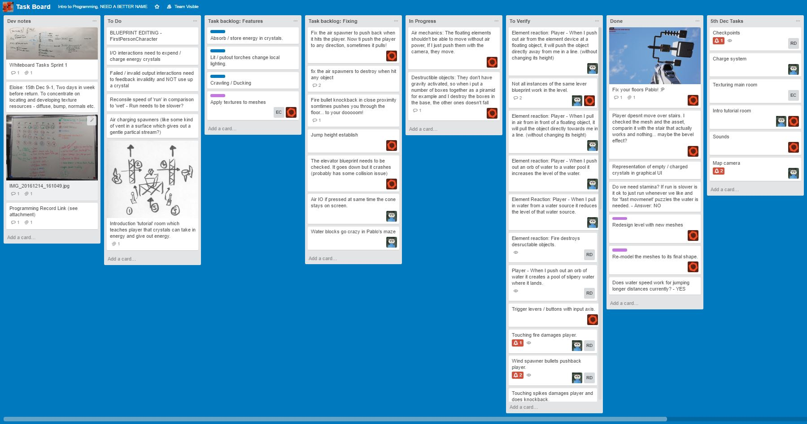
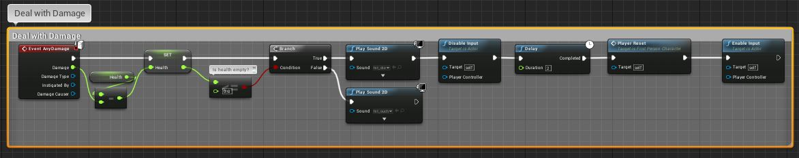
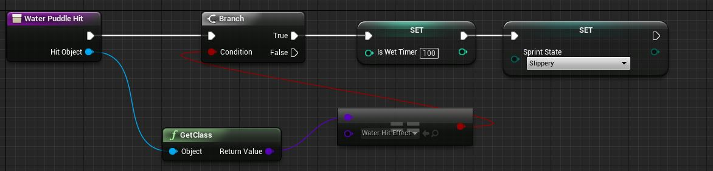
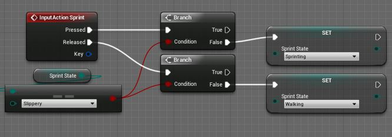
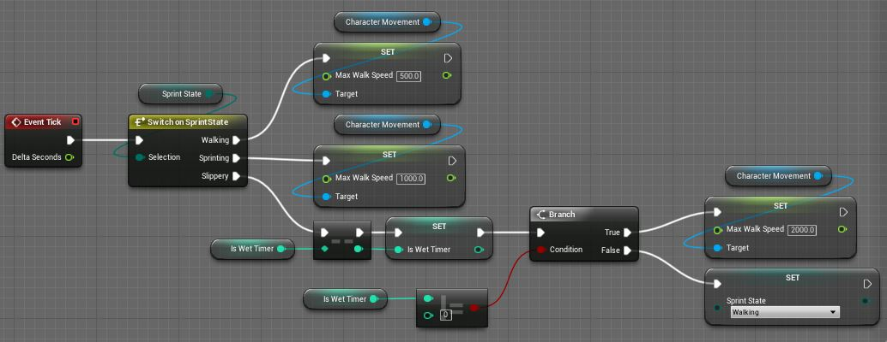
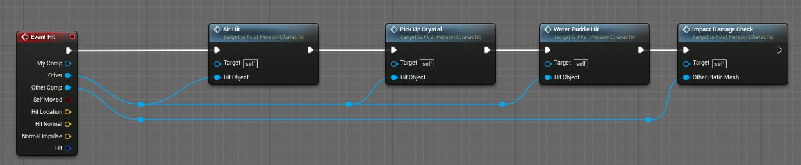
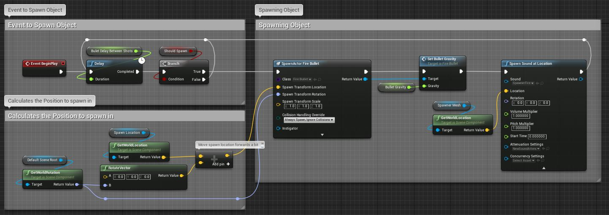

# Brief 
To create an game set in a dungeon with 3 artists and 2 programmers. Used GitHub for version control and Unreal Engine as the build platform. The game should focus on gameplay and UI programming. 

# Introduction
The basic game concept is to manipulate the elements around you to solve the puzzle of the dungeon. In this version of the game we currently have air, fire and water. With each element you can either absorb or expel the elements from your mystical gun. 

With air you can move around objects, in the demo level there are floating blocks to jump across. 

With fire you can light or extinguish the torches and fire pits around the level. There are also destructible objects can contain items which can help in your quest. 

With water you can raise or lower water sources which can contain floating blocks which the player needs to cross the poisonous water. Another feature of the water is its speed multiplier. When you are slippery the speed can either be a help or hindrance depending on the part of the level. 

# Technical Problems

## Using GitHub and Unreal Engine 

On this project we had a lot of problems with version control due the unreal saving blueprints and assets as binary files. This meant that in our initial design phase we had to set up a work flow which meant that everyone on the team could work simultaneously without losing work. This meant that each artist had their own level and working directory. This had worked when we had started the project however when merging the levels. We had worked through Trello to make sure that we were not deleting work done by another team member. On Trello blueprint cards were added so that if a team member was working on that blueprint it was off limits for other members. This worked well as a solution and kept everyone up to date.

# Technical Explanation
In this section I will explain the technical implementation of mechanics. The way that Matthew Duddington and I worked was very collaborative so that we both had input into how the blueprints functioned. We accomplished this using a Trello board (www.trello.com) where we created cards for each programming and design task. When we wanted to use a task we simply dragging it into "in progress" and tagged it with our name. This also was a great tool for the artists to create mechanic fixing tasks. This process was a constant working document but have a snapshot of the task board below.  

## Player Movement
We decided to take the standard first person controller, which comes inside of the Unreal Engines starter pack, and modify it to suit are needs. The functionality that was mostly unchanged are listed below: 
    - Mouse input for rotating the camera. 
    - Input Action to make the player jump using space bar. 
    - The input action to make the player move around using the WASD keys.

### Damage 
For the players damage the built in Unreal event handler was used. As seen in the screenshot below when any damage is done to the player it performs the following actions:

    - Take away the amount of damage done by the object. 
    - Checks whether the player has died, 
        - If no then play the player hurt sound and end process
        - If yes then play the player died sound
            - After disable the input 
            - Wait for 2 seconds
            - Call the custom respawn function 
            - Then enable the input from the player when respawned

Please see the respawned section to see how that function is handled

###Water slippery movement sprint

This mechanic was split into 3 functions. A player hit, sprint key input and a set the players movement. An Enum was used to store and switch the state of each movement. 

The water hit function is called when anything hits the player. It works using this logic:
- Check to see what has hit the player
    - If the Water Hit Effect Class then 
        - Set the isWet timer 
        - Set the sprint state to slippery

The players sprint is a simple input action which sets the sprint state to either sprinting or walking. However these two actions can not happen when the player is effected by water otherwise they can negate the effect of the water by pressing the sprint key. So the check 
to see if player is slippery branches were added. 

The last part of the player sprint is to set the max walk speed. This take the enum value and sets the speed accordingly. The slippery state is slightly different because it is disable when the timer reaches zero. 
# state problems of doing it this way. Event tick happens everyframe which sets the speed of the player every frame instead of when the state change happens

 

###Changing between different gun modes 
(I think you did the UI linking and initial firing of projectiles? I did the separation into different events (or maybe we did the initial part of that together that time early in the lab) then I added all the dependency and special cases gumph)

### player hit event 

The players hit event was initially a very long chain of nodes which was not clear. We added a function for each of the object that we wanted to perform a task. It has a very simple chain of functions. However if in future improvements to this function I would use the custom event function which allows the separation of these functions. The objects would just use the function CastToFirstPersonController and call the custom event like the pick up health potion blueprint. 

The player hit function chain 
 

Any example of one of hit functions.

## Technical UI Setup
The way that Unreal handles the UI is by blinding a variable in the inspector to a get variable function. This allows any of the variables with in the player to be accessed and used as a text display or a visual indication of an event. 

## Elemental Spawner

The elemental spawner just fire spawn a projectile which then is destroyed on contacted with another object. This would be optimised by having a buffer of projectiles that would be disabled on and reset on contact. Initially the spawners were using the event tick function which meant that it would perform the spawn action every frame of the game. Matthew updated the blueprint so that it would run on event begin so it only needs to be called once and keep a track off its delay timer. 

## Pick ups

The items that you could pick up in the levels followed the same format as the example screenshot. The logic of this blueprint is shown below using pusedo code. 
	
	- When an object hits the object
	- Cast to first person character 
	- if cast worked
	- Then as the player 
		- add health
		- Play a 2D sound
		- Destroy the actor. 
		
These logic was applied to the Health and also the Crystals. 

## Destructible crystal urn 

The destructible objects that are in the scene use the Unreal engine tool which allows you to create a destructable mesh from any model that has been imported into Unreal. When this blueprint was first implemented, we did not have a full understanding of how the damage system works with the destructable mesh. This system is has a lot of loading overhead, however in future updates this would be one mesh which on damage splits into parts. 

An explation of how this blueprint works in below. 

	- When the inital mesh is hit
	- Check to see what object has collided
	- If it is a fire projectile
	- Then 
		- spawn destructable mesh 
		- Play a sound
		- Spawn an item (Crystal or health) 
		- Destroy the old mesh 

$$$$$$$$$$$$$$$$$$$$$$$ Link to destructable screen shot image 

## player respawn checkpoints 

The players respawn were using the standard Unreal level reload function, however the design of the level meant that we couldnt use it without having loading screen after every save point. So a custom event handler was created within the player. Checkpoint variables were created for location and amount of crystals the player has. When the player overlaps a checkpoint these variables were updated with the current state. So when the player dies it calls a reset function instead of reloading the level. The event for dying disable the players input and displayed a visual overlay so that it was sudden and unclear as why they are teleporting back to the checkpoints.

## Room Reseters

